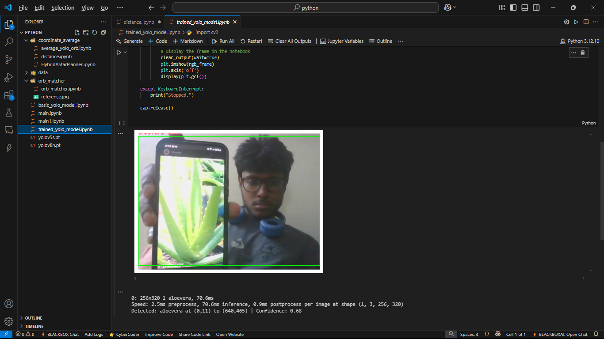
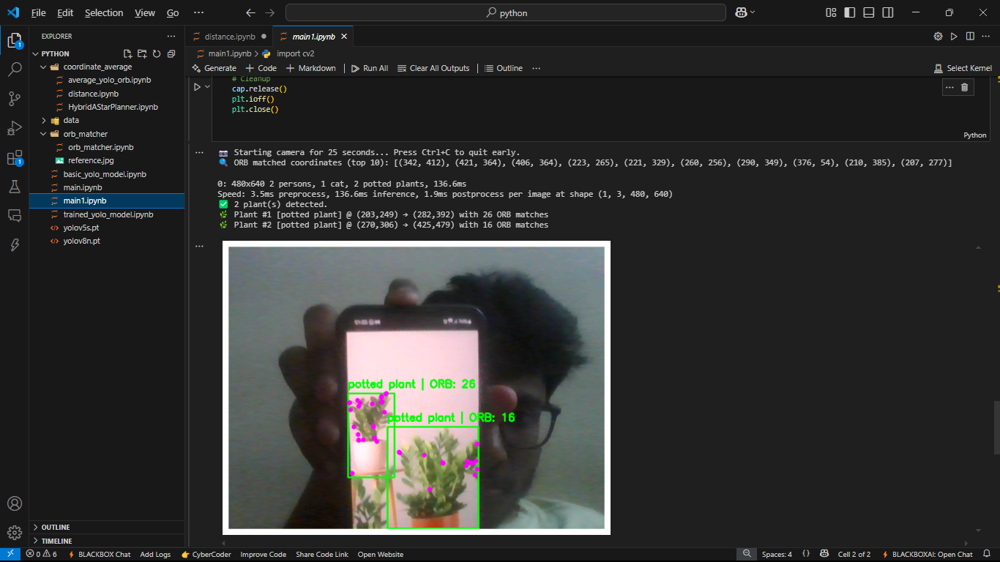
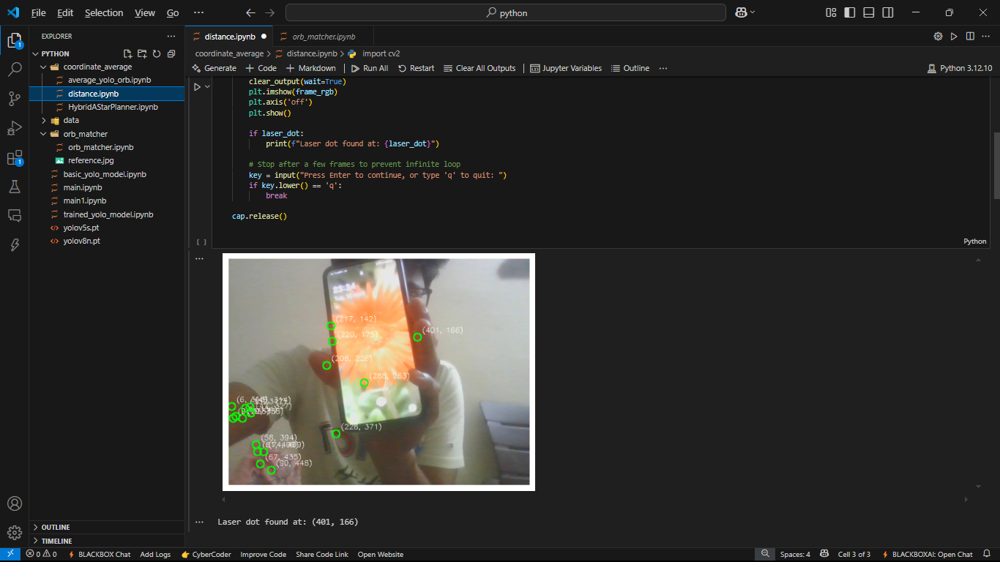
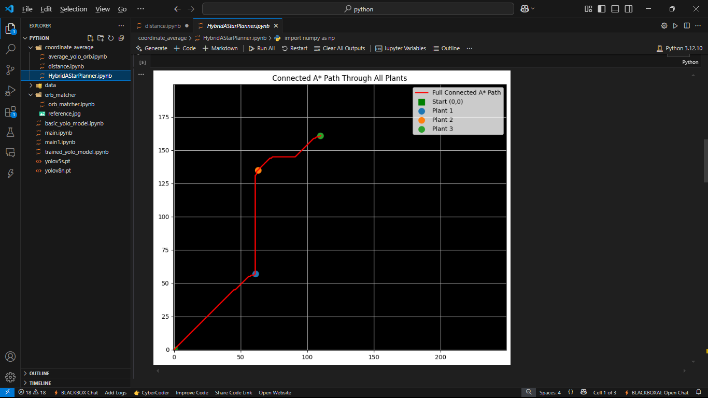
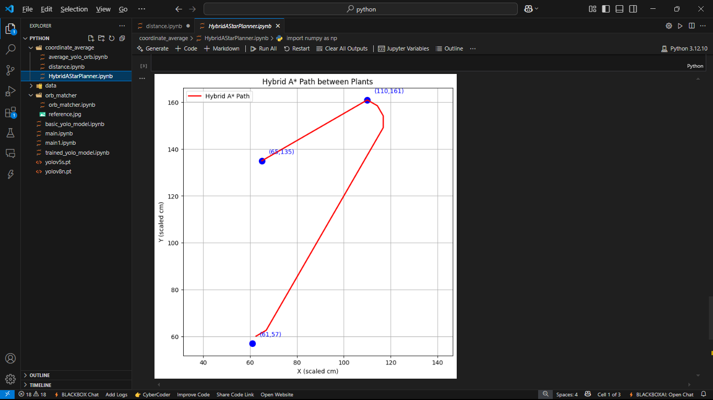

# 🌱 Plantnav System

AI-powered real-time plant detection, localization, distance estimation, and autonomous navigation system using YOLOv8, ORB feature matching, laser triangulation, and Hybrid A* path planning.

---

# 📌 Overview

Plantnav System is a low-cost intelligent agricultural navigation framework designed for plant detection and robotic path planning in structured and semi-structured environments.

The system combines:

* YOLOv8 custom plant detection
* YOLOv8 COCO object detection
* ORB feature refinement
* Laser triangulation distance estimation
* Hybrid A* navigation
* ESP8266 IoT communication

The project was developed using Python, OpenCV, Ultralytics YOLOv8, and classical robotics algorithms.

---

# 🚀 Features

✅ Real-time plant detection
✅ Custom-trained YOLOv8 model
✅ ORB-based center refinement
✅ Laser triangulation distance estimation
✅ Hybrid A* path planning
✅ Real-time visualization
✅ ESP8266 laser control
✅ Low-cost hardware setup

---

# 🧠 System Architecture

The system pipeline:

1. Camera captures live frame
2. YOLOv8 detects plants
3. ORB extracts keypoints
4. Center coordinates are refined
5. Laser triangulation estimates distance
6. Hybrid A* generates collision-free path

---

# 🛠️ Tech Stack

* Python
* YOLOv8 (Ultralytics)
* OpenCV
* ORB Feature Matching
* NumPy
* Matplotlib
* ESP8266
* Hybrid A*
* Jupyter Notebook

---

# 📂 Project Structure

```bash
Plantnav-System/
│
├── coordinate_average/
├── data/
├── orb_matcher/
├── images/
│   ├── 1.png
│   ├── 2.png
│   ├── 3.png
│   ├── 4.png
│   └── 5.png
│
├── requirements.txt
├── README.md
├── main.ipynb
└── trained_yolo_model.ipynb
```

---

# 📸 Results

## 1️⃣ Custom YOLOv8 Plant Detection

Custom-trained YOLOv8 model detecting Aloe Vera and Banana plants.



---

## 2️⃣ YOLOv8 + COCO + ORB Refinement

Combined detection using trained YOLOv8, COCO-pretrained YOLOv8, and ORB feature matching.



---

## 3️⃣ Laser Triangulation Distance Estimation

Laser-based distance estimation using ESP8266-controlled laser positioning.



---

## 4️⃣ Hybrid A* Path Planning

Smooth curvature-aware navigation path generated using Hybrid A*.



---

## 5️⃣ Traditional A* Path Planning

Standard A* path planning visualization.



---

# ⚙️ Installation

Clone the repository:

```bash
git clone https://github.com/Japesh21/Plantnav-System.git
cd Plantnav-System
```

Install dependencies:

```bash
pip install -r requirements.txt
```

---

# ▶️ Training YOLOv8

```python
from ultralytics import YOLO

model = YOLO("yolov8n.pt")

model.train(
    data="data/data.yaml",
    epochs=50,
    batch=4,
    imgsz=416,
    name="plantnav_training",
    device="cpu"
)
```

---

# 🧪 Experimental Setup

* Standard laptop webcam
* ESP8266 microcontroller
* Laser module
* Python-based processing pipeline
* Real-time matplotlib visualization

---

# 📊 Performance

| Metric              | Value          |
| ------------------- | -------------- |
| FPS                 | 9–12 FPS       |
| Detection Time      | 60–110 ms      |
| Distance Estimation | ±4 cm accuracy |
| Processing          | Real-time      |

---

# 🔬 Future Improvements

* Real robot deployment
* Servo motor automation
* Improved triangulation accuracy
* GPS integration
* Autonomous agricultural rover
* Edge AI optimization

---

# 📚 Research Reference

This project is based on the research paper:

**Plantnav System — Real-Time Intelligent Navigation for Plant Detection and Path Planning**

---

# 👨‍💻 Authors

* Vundavalli Japesh Mohan
* V. Raam
* Dr. Sridhar S. S (Guide)

SRM Institute of Science and Technology

---

# 📜 License

This project is for educational and research purposes.
